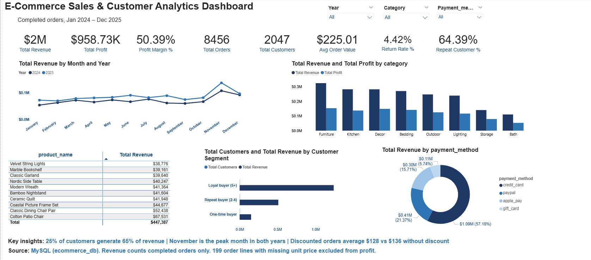

# 🛒 E-Commerce Sales & Customer Analytics

End-to-end data analytics project: raw e-commerce data → SQL cleaning & analysis → Power BI dashboard.

---

## 🖥️ Dashboard Preview

<p align="center">
  
</p>

---

## 📊 Project Overview

This project analyzes an e-commerce dataset containing customer, order, line item, and product details to solve core business questions regarding revenue growth, profitability, customer retention, and payment/discount performance.

All data cleaning and transformation workflows were executed entirely within **MySQL** (avoiding manual Excel or Python operations) to ensure the full data pipeline is reproducible directly from the raw CSV files provided in this repository.

---

## 🗂️ Dataset Architecture

- **Scale:** ~9,200 orders · ~15,600 order line items · 2,047 customers · 90 products
- **Tables:** `customers`, `orders`, `order_items`, `products`
- **Raw Data Path:** `data/raw/`

---

## 🛠 Tools Used

- **MySQL:** Bulk data loading, data cleaning, relational schema transformations, and business metric calculations.
- **Power BI:** Interactive analytical dashboards, custom DAX measures, and cross-tool data validation.
- **Microsoft Excel:** Initial data inspection and preliminary duplicate verification prior to database ingestion.

---

## 🧹 Data Cleaning & Pipeline Resolution

Raw files were loaded as-is and sanitized using SQL scripts. Every transformation is fully auditable and reproducible.

| Data Issue | Root Cause | SQL Engineering Solution |
| :--- | :--- | :--- |
| **Import Wizard Drop/Hang** | Large file size limit exceeded | Replaced wizard with optimized `LOAD DATA LOCAL INFILE` queries. |
| **Error 3948 (`local_infile`)** | Server & client security restrictions | Enabled globally on server (`SET GLOBAL local_infile=1`) and updated Workbench client configuration. |
| **Error 1062 (Duplicate Rows)** | 38 duplicate `order_id` records | Validated exact duplicates via Excel `COUNTIF`, then enforced `PRIMARY KEY` constraints during ingestion to reject duplicates. |
| **Error 1366 (Blank Prices)** | 199 missing `unit_price` entries | Applied `NULLIF()` during bulk load to convert blank strings to `NULL`, preventing default `0` values from corrupting revenue metrics. |
| **Inconsistent Categorization** | Mixed case casing (`Kitchen`, `kitchen`, `KITCHEN`) | Standardized text into Title Case formatting during bulk load using `TRIM`, `UPPER`, and `LOWER` functions. |
| **Error 1265 (Data Truncation)** | `product_name` exceeded column length | Diagnosed SQL warnings and updated `VARCHAR` column lengths prior to re-ingestion. |

> *Full pipeline execution details are available in `sql/02_load_data.sql` and `sql/03_foreign_keys.sql`.*

---

## 📈 Key Business Insights

* **Customer Pareto Principle:** 25% of customers (loyal segment, 5+ orders) generate 65% of total revenue. One-time buyers comprise 35.6% of the customer base but account for only ~8% of total revenue.
* **Revenue vs. Profitability Discrepancy:** The **Furniture** category leads in gross revenue ($325K), but **Storage** generates the highest profit margin (56.5%) despite lower overall sales volume.
* **Seasonal Demand Signals:** November represents the peak sales month across both 2024 and 2025, generating ~40–50% higher revenue compared to surrounding months.
* **Discount Strategy Performance:** Discounted orders produced a lower Average Order Value (**$128**) compared to non-discounted orders (**$136**), indicating that current promotions are not increasing basket sizes.
* **Payment Preference:** Credit Card transactions drive 57% of total revenue, generating more than double the volume of all other payment options combined.
* **Cross-Tool Metric Validation:** Identified a profit-margin discrepancy between SQL and Power BI caused by DAX handling `BLANK` values as `0`. Reconciled the DAX measure to handle `NULL` values consistently with SQL using the 199 missing-price rows.

---

## 🖥️ Dashboard Architecture

The interactive Power BI dashboard (`dashboard/ecommerce_dashboard.pbix`) provides executive and operational views:

* **Executive KPI Cards:** Total Revenue, Gross Profit, Margin %, Total Orders, Customer Count, AOV, Return Rate, Repeat Customer %
* **Trend Analysis:** Monthly revenue performance split by year (2024 vs. 2025)
* **Category Performance:** Revenue and profit breakdown across product categories
* **Product Performance:** Top 10 products ranked by total revenue
* **Customer Segmentation:** Revenue distribution across customer loyalty tiers
* **Payment Insights:** Revenue breakdown by transaction payment method

---

## 📁 Repository Structure

```text
ecommerce-sales-analytics/
│
├── README.md
├── data/
│   └── raw/
│       ├── customers.csv
│       ├── Raworders.csv
│       ├── Raworder_items.csv
│       └── Rawproducts.csv
├── sql/
│   ├── 01_create_tables.sql
│   ├── 02_load_data.sql
│   ├── 03_foreign_keys.sql
│   └── 04_analysis_queries.sql
└── dashboard/
    ├── ecommerce_dashboard.pbix
    └── dashboard_screenshot.png


    
